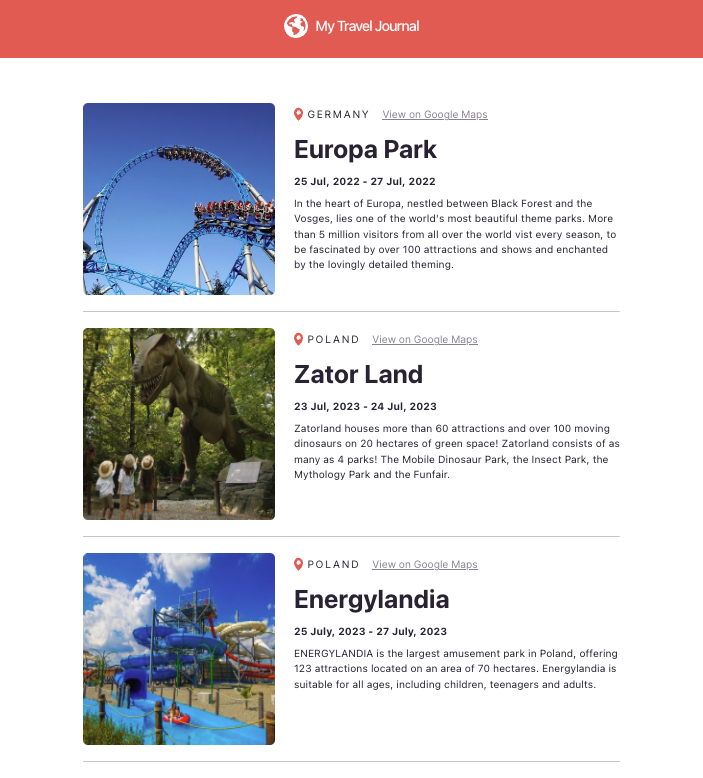

# My Travel Journal

## Description
I have created a visually captivating travel journal using props to create reusable components in React. This journal showcases a collection of the destinations I've had the pleasure of visiting. The project was completed using React in conjunction with  Vite.

## Technologies
* HTML
* CSS
* JSX
* Vite
* React
* Bootstrap

## Screenshot

## Deployed Site
https://travel-journal-ogbbud8sk-ladykays-projects.vercel.app

## Licence
This project is licensed under the MIT License. [View licence](https://opensource.org/licenses/MIT)

